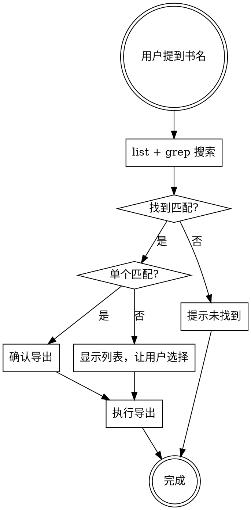
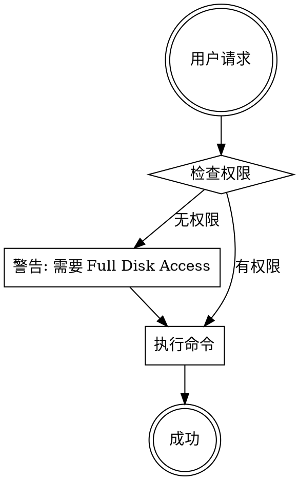

# Apple Books Export (Rust)

## Overview

Rust 版本的 Apple Books 笔记导出工具。编译后生成单文件二进制，无需 Python 环境。

**核心优势**：
- 单文件二进制 (11MB)
- 无运行时依赖
- 启动快 (~10ms)
- 跨平台支持 (macOS ARM/x86_64, Linux)

## When to Use

User mentions:
- "Apple Books" / "Books app" / "iBooks"
- "导出书籍笔记" / "books notes" / "highlights"
- "AI 增强笔记" / "enrich" / "知识卡片"
- "生成卡片" / "card"
- "查看笔记数量" / "note count"

## Prerequisites

**系统要求**:
- macOS only（Apple Books 数据仅存在于 macOS）
- Full Disk Access 权限

**权限设置**:
```
System Settings → Privacy & Security → Full Disk Access → Add Terminal or the binary
```

## Installation

### 快速安装

```bash
# 进入 skill 目录
cd skills/apple-books-export-rust/scripts

# 运行安装脚本（自动检测平台）
./install.sh
```

安装脚本会：
1. 检测当前系统平台 (macOS ARM/Intel, Linux)
2. 选择对应的二进制文件
3. 复制到 `~/.agents/skills/apple-books-export-rust/scripts/`

### 手动安装

```bash
# 创建目录
mkdir -p ~/.agents/skills/apple-books-export-rust/scripts

# 复制文件
cp skills/apple-books-export-rust/SKILL.md ~/.agents/skills/apple-books-export-rust/
cp skills/apple-books-export-rust/scripts/apple-books-exporter ~/.agents/skills/apple-books-export-rust/scripts/
chmod +x ~/.agents/skills/apple-books-export-rust/scripts/apple-books-exporter
```

## Binary Location

```bash
# Skill 安装路径
~/.agents/skills/apple-books-export-rust/scripts/apple-books-exporter

# 或添加到 PATH
cp ~/.agents/skills/apple-books-export-rust/scripts/apple-books-exporter /usr/local/bin/
```

**平台支持**:
| 平台 | 二进制文件 |
|------|-----------|
| macOS ARM (M1/M2/M3) | `apple-books-exporter-aarch64-apple-darwin` |
| macOS Intel | `apple-books-exporter-x86_64-apple-darwin` |
| Linux x86_64 | `apple-books-exporter-x86_64-unknown-linux-gnu` |

## Quick Reference

| 任务 | 命令 |
|------|------|
| 列出书籍 | `apple-books-exporter list` |
| 导出笔记 | `apple-books-exporter export <序号>` |
| 按书名搜索导出 | `apple-books-exporter export -t "<书名>"` |
| 指定输出目录 | `apple-books-exporter export <序号> -o ~/Desktop` |
| AI 增强（单条） | `apple-books-exporter enrich <书序号> --index <笔记序号>` |
| AI 增强（全量） | `apple-books-exporter enrich <书序号> --all` |
| AI 增强（强制刷新） | `apple-books-exporter enrich <书序号> --all --force` |
| 生成卡片 | `apple-books-exporter card <书序号> --all` |
| 查看缓存 | `apple-books-exporter cache <书序号>` |
| 配置 LLM | `apple-books-exporter config --api-key <key>` |

## Title Search Workflow

当用户提到书名时：



**示例对话**:
```
用户: "导出宝典的笔记"
Agent: 
  1. apple-books-exporter list | grep -i "宝典"
  2. 找到匹配：
     195. 纳瓦尔宝典 - 218 条笔记
     196. 穷查理宝典 - 50 条笔记
  3. 请确认导出哪一本？
  
用户: "导出纳瓦尔宝典"
Agent:
  apple-books-exporter export 195 -o ~/Desktop
  ✅ 已导出到 ~/Desktop/纳瓦尔宝典_xxxxx.md
```

## Commands

### list - 列出书籍

```bash
apple-books-exporter list
```

输出示例：
```
1. 深入理解计算机系统 - Randal E.Bryant - 45 条笔记
2. 纳瓦尔宝典 - Eric Jorgenson - 218 条笔记
3. 穷查理宝典 - Peter Kaufman - 50 条笔记
...
共 256 本书
```

### export - 导出笔记

```bash
# 按序号导出
apple-books-exporter export 1

# 按书名搜索导出
apple-books-exporter export -t "纳瓦尔"

# 指定输出目录
apple-books-exporter export 1 -o ~/Desktop/books

# 指定格式
apple-books-exporter export 1 --format obsidian  # obsidian 或 markdown
```

导出的 Markdown 格式：
```markdown
# 书名

**作者**: 作者名
**笔记数**: 45

---

## 高亮与笔记

### 1. 第3章 程序的机器级表示
*2025-01-15 10:30*

> 高亮的文字内容...

**笔记**: 我的笔记内容

---
```

### enrich - AI 增强笔记

为高亮笔记添加 LLM 生成的解释、标签、复习问题。

**前提条件**: 需要配置 LLM API（见配置章节）。

```bash
# 处理单条笔记
apple-books-exporter enrich 1 --index 42

# 处理整本书（默认前 5 条）
apple-books-exporter enrich 1

# 处理整本书所有笔记
apple-books-exporter enrich 1 --all

# 强制重新生成（跳过缓存）
apple-books-exporter enrich 1 --all --force

# 指定输出目录
apple-books-exporter enrich 1 --all -o ~/obsidian/books
```

输出示例 (Obsidian 格式)：
```markdown
---
type: llm-note
book: 纳瓦尔宝典
chapter: item465
tags: [财富, 杠杆, 代码, 边际成本, 复利]
---

## 原文
代码是现代社会的杠杆，因为它可以零边际成本地复制和分发。

## 解释
代码是一种独特的杠杆形式，不同于传统劳动力或资本，它具有零边际成本复制的特性，能够创造指数级回报。

## 复习问题
为什么说代码是比劳动力和资本更高效的杠杆？
```

### card - 生成图片卡片

将笔记生成为精美的图片卡片，适合分享到社交媒体。

```bash
# 生成单条卡片
apple-books-exporter card 1 --index 42

# 批量生成
apple-books-exporter card 1 --all

# 指定样式
apple-books-exporter card 1 --all --style dark     # dark/light/minimal

# 指定输出目录
apple-books-exporter card 1 --all -o ~/cards
```

**卡片样式**:
- `dark` - 深色背景，适合代码/技术内容
- `light` - 浅色背景，适合一般内容
- `minimal` - 极简风格

### cache - 查看缓存

查看 LLM 处理结果的缓存状态。

```bash
apple-books-exporter cache 1
```

输出示例：
```
书籍: 纳瓦尔宝典
缓存文件: llm_cache.json
已缓存: 45 条
总笔记: 218 条
待处理: 173 条
```

### config - 配置 LLM

```bash
# 查看当前配置
apple-books-exporter config

# 设置 API Key
apple-books-exporter config --api-key "sk-xxx"

# 设置完整配置
apple-books-exporter config \
  --base-url "https://api.openai.com/v1" \
  --api-key "sk-xxx" \
  --model "gpt-4o-mini"
```

## LLM Configuration

配置文件：`knowledge_config.json`

```json
{
  "llm": {
    "provider": "openai_compatible",
    "base_url": "https://api.openai.com/v1",
    "api_key": "sk-xxx",
    "model": "gpt-4o-mini",
    "batch_size": 10,
    "max_retries": 3,
    "retry_delays": [1, 2, 4]
  },
  "output_format": "obsidian",
  "context_chars": 200
}
```

**支持的 API (OpenAI 兼容)**:

| Provider | Base URL | Model |
|----------|----------|-------|
| OpenAI | `https://api.openai.com/v1` | gpt-4o-mini, gpt-4o |
| DeepSeek | `https://api.deepseek.com/v1` | deepseek-chat |
| 通义千问 | `https://dashscope.aliyuncs.com/compatible-mode/v1` | qwen-turbo |
| MiMo | `https://token-plan-cn.xiaomimimo.com/v1` | mimo-v2.5-pro |
| Ollama (本地) | `http://localhost:11434/v1` | llama3 |

## Data Location

Apple Books 数据存储在：
```
~/Library/Containers/com.apple.iBooksX/Data/Documents/
├── BKLibrary/BKLibrary-*.sqlite      # 书籍元数据
└── AEAnnotation/AEAnnotation_*.sqlite # 笔记/标注数据
```

**Annotation Types**:
- 0: 书签 (Bookmark)
- 1: 笔记 (Note)
- 2: 高亮 (Highlight)
- 3: 标注 (Annotation = highlight + note)

## Workflow Diagram



## Common Issues

| 问题 | 解决方案 |
|------|----------|
| Permission denied | 终端添加 Full Disk Access 权限 |
| No books found | 用户需要在 Apple Books 中添加笔记 |
| LLM 401 错误 | 检查 API Key 配置 |
| LLM 超时 | 检查网络连接，或增加 retry_delays |
| 二进制无法运行 | `chmod +x apple-books-exporter` |

## Architecture

```
src/
├── main.rs           # CLI 入口 (clap)
├── models.rs         # 数据结构
├── db.rs             # SQLite 数据访问
├── cfi.rs            # EPUB CFI 解析
├── config.rs         # 配置管理
├── cache.rs          # LLM 结果缓存
├── provider.rs       # LLM API 调用
├── exporter.rs       # Markdown 导出
├── card.rs           # 图片卡片生成
├── prompt.rs         # LLM 提示词
└── utils.rs          # 工具函数
```

## Python vs Rust 版本对比

| 特性 | Python | Rust |
|------|--------|------|
| 环境依赖 | Python 3.14 + tkinter | 无（编译后单文件） |
| 启动速度 | ~500ms | ~10ms |
| 二进制大小 | N/A（需要 Python） | 11MB |
| 安装复杂度 | 高 (Homebrew + pip) | 低 (复制文件) |
| AI 增强 | ✅ | ✅ |
| 图片卡片 | ✅ (Pillow) | ✅ (image crate) |
| 跨平台 | ❌ | ✅ |
| GUI | ✅ (PyQt6) | ✅ (Tauri) |

## Red Flags - Check Before Acting

- 用户提到 Apple Books → **先调用此 skill**
- 用户提到书名 → **先 list 找序号，再操作**
- "Let me check the code first" → **No, use the commands above**
- "I need to understand the database schema" → **No, the tool handles it**
- "This is simple, I'll just..." → **Stop, follow the workflow**

## Build from Source

如果需要从源码编译：

```bash
# 克隆仓库
git clone https://github.com/chenweil/apple-books-export.git
cd apple-books-export

# 安装 Rust
curl --proto '=https' --tlsv1.2 -sSf https://sh.rustup.rs | sh

# 编译
cargo build --release

# 二进制位置
ls -lh target/release/apple-books-exporter

# 复制到 skill 目录
cp target/release/apple-books-exporter ~/.agents/skills/apple-books-export-rust/scripts/
```

## Changelog

### v0.3.0 (2025-06-13)
- ✅ 完整 CLI 功能 (list/export/enrich/card/cache/config)
- ✅ LLM 缓存机制
- ✅ 图片卡片生成 (dark/light/minimal)
- ✅ Tauri GUI 支持
- ✅ 跨平台编译支持

### v0.1.0 (2025-05-27)
- 初始 Rust 版本
- 基础 list/export 功能
