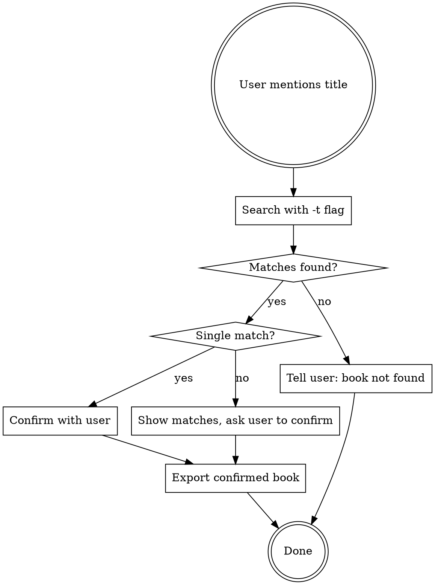
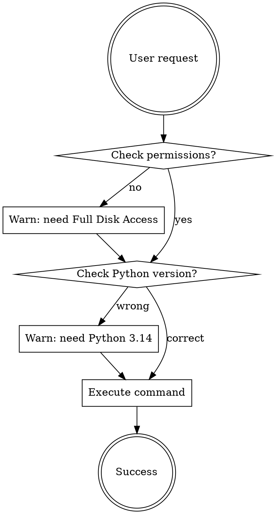

# Apple Books Export

## Overview

Guide for accessing and exporting notes/highlights from macOS Apple Books using the `books-exporter` project.

**Core principle**: Apple Books stores data in SQLite databases that require full disk access permission. Always check prerequisites before executing commands.

## When to Use

User mentions:
- "Apple Books" / "Books app" / "iBooks"
- "导出书籍笔记" / "books notes" / "highlights"
- "查看笔记数量" / "note count"
- Working with EPUB annotations on macOS

## Prerequisites

**System Requirements**:
- macOS only (Apple Books data is macOS-specific)
- Full Disk Access permission

**Permission Setup**:
```
System Settings → Privacy & Security → Full Disk Access → Add Terminal or the binary
```

**Installation**:
```bash
# Option 1: Use binary directly
./dist/books-exporter list

# Option 2: Add to PATH
cp dist/books-exporter /usr/local/bin/
books-exporter list
```

## Quick Reference

| Task | Command |
|------|---------|
| List books with notes | `books-exporter list` |
| Interactive export | `books-exporter export` |
| Export by book number | `books-exporter export <number>` |
| **Export by title** | `books-exporter export -t "<title>"` |
| Export to directory | `books-exporter export -t "<title>" -o ~/Desktop` |

**Binary Location**: `dist/books-exporter` (or add to PATH)

## Title Search Workflow

When user mentions a book title:



**Example**:
```bash
# User: "导出宝典的笔记"
# Agent: 
books-exporter export -t "宝典" -o ~/Desktop

# If no matches:
# "您的书籍中不存在包含 'XXX' 的书籍"

# If multiple matches, show list and ask:
# "找到 3 本匹配的书籍：
# 1. 纳瓦尔宝典 - 217 条笔记
# 2. 穷查理宝典 - 50 条笔记
# 3. XXX宝典 - 30 条笔记
# 请确认要导出哪一本？"
```

## Build Binary

```bash
# Install PyInstaller (one-time)
pip install pyinstaller

# Build
pyinstaller --onefile --name books-exporter books_exporter.py

# Output: dist/books-exporter
```

## Workflow



## Data Location

Apple Books data stored in:
```
~/Library/Containers/com.apple.iBooksX/Data/Documents/
├── BKLibrary/BKLibrary-1-091020131601.sqlite      # Book metadata
└── AEAnnotation/AEAnnotation_v10312011_1727_local.sqlite  # Notes/highlights
```

## Common Issues

| Issue | Solution |
|-------|----------|
| Permission denied | Grant Full Disk Access to Terminal or the binary |
| Binary not found | Build with `pyinstaller --onefile --name books-exporter books_exporter.py` |
| No books found | User needs to add notes in Apple Books first |

## CLI vs GUI

**This skill uses the CLI binary only.** No Python installation required.

Binary: `dist/books-exporter` (8.8MB, standalone)

## Red Flags - Check Before Acting

- User mentions Apple Books → **Invoke this skill first**
- User mentions book title → **Use `-t` flag, confirm if multiple matches**
- "Let me check the code first" → **No, use the commands above**
- "I need to understand the database schema" → **No, the tool handles it**
- "This is simple, I'll just..." → **Stop, follow the workflow**

## Implementation Notes

**For this project only**: The `books-exporter` project is in the current workspace. Commands should be run from the project root.

**EPUB CFI Parsing**: The tool automatically parses EPUB CFI (Canonical Fragment Identifier) to extract chapter information from `ZANNOTATIONLOCATION` fields.

**Annotation Types**:
- 0: Bookmark
- 1: Note
- 2: Highlight  
- 3: Annotation
